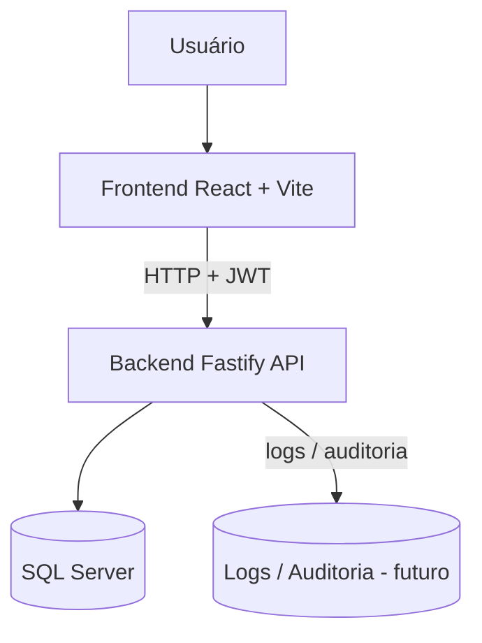
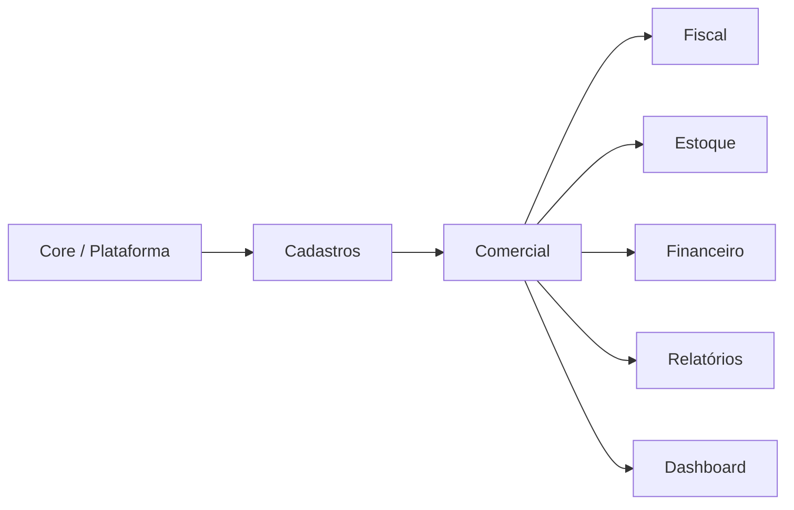
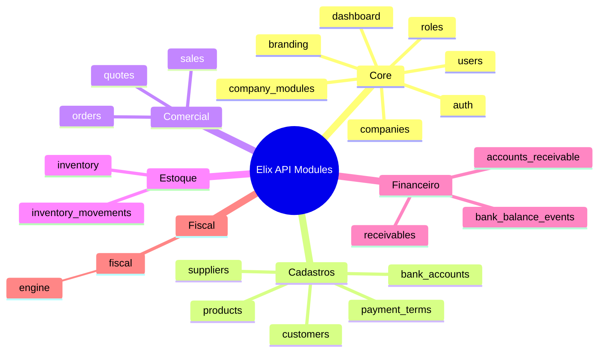
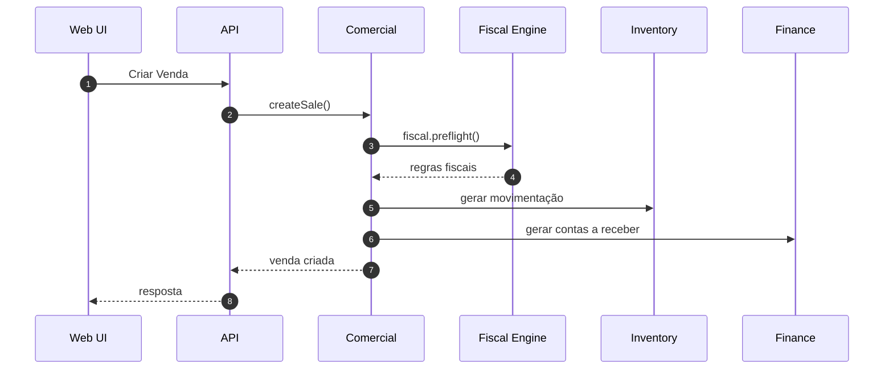
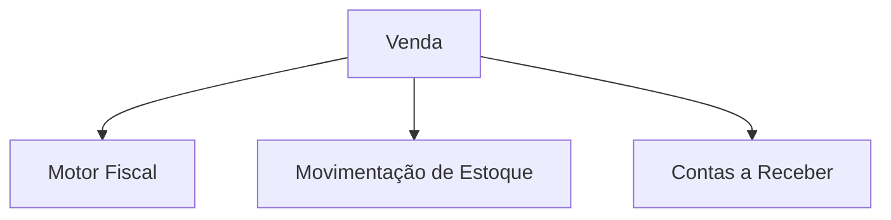

# Elix ERP Next — Architecture Diagram

Este documento descreve a arquitetura de alto nível do **Elix ERP Next**.
Os diagramas usam **Mermaid**, que é renderizado automaticamente pelo GitHub.

---

# 1. Visão geral do sistema

---

# 2. Domínios do ERP

---

# 3. Módulos do Backend

---

# 4. Fluxo principal do ERP

---

# 5. Fluxo de impacto da venda

---

# 6. Segurança

O backend utiliza três camadas de controle:

### Autenticação
JWT com:

req.auth = { userId, companyId, roles, perms }

### RBAC
Middleware:

requirePermission("permission_code")

### Feature gating por empresa

Tabela:

company_modules

Middleware:

requireModule("module_key")

---

# 7. Princípios arquiteturais

O Elix ERP Next segue estes princípios:

- arquitetura modular
- multiempresa (multi-tenant)
- domínio separado por módulos
- controllers sem regra de negócio
- regras no service layer
- banco acessado apenas via repository

---

# Referências

Documentos relacionados:

ARCHITECTURE.md  
docs/00-overview/erp-map.md  
docs/00-overview/erd-core.md  
docs/adr/*
