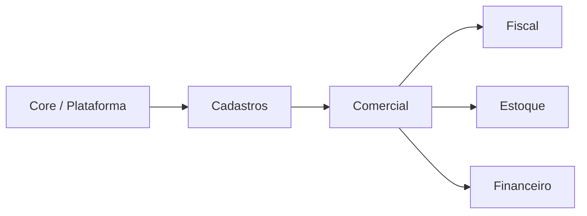
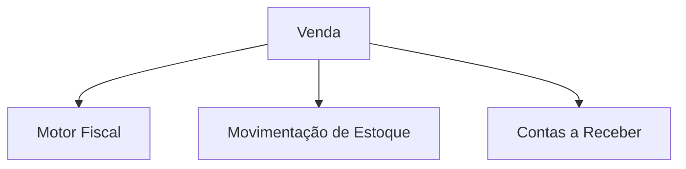

# Elix ERP Next — Domain Boundaries (Arquitetura Constitucional)

Este documento define as **fronteiras de domínio** do Elix ERP Next.

Ele funciona como a **"constituição" do sistema**.

Objetivo:

- evitar acoplamento acidental entre módulos
- manter regras de negócio organizadas
- definir claramente quem é responsável por cada decisão do sistema
- garantir consistência ao longo da evolução do ERP

---

# 1. Domínios Soberanos do Sistema

O Elix ERP Next é dividido em domínios principais.

Cada domínio possui **autoridade exclusiva** sobre determinadas regras.

---

# 2. Domínio Core

Responsável pela infraestrutura do sistema.

Módulos:

- auth
- users
- roles
- companies
- company_modules
- branding

Responsabilidades:

- autenticação (JWT)
- RBAC (roles e permissions)
- multiempresa
- habilitação de módulos por empresa

Princípio:

Nenhum domínio de negócio deve implementar lógica de autenticação ou controle de acesso.

---

# 3. Domínio Cadastros

Responsável pelos **dados mestres** do sistema.

Módulos:

- products
- customers
- suppliers
- bank_accounts
- payment_terms

Esses dados são utilizados por:

- comercial
- fiscal
- estoque
- financeiro

Princípio:

Domínios consumidores **não são donos desses dados**.

---

# 4. Domínio Comercial

Responsável pelo ciclo de venda.

Fluxo principal:

Quote → Order → Sale

Módulos:

- quotes
- orders
- sales

Responsabilidades:

- criação de vendas
- controle de itens da venda
- estados da venda

Princípio:

Comercial **não calcula imposto**, **não altera estoque diretamente** e **não cria títulos financeiros diretamente**.

Ele apenas dispara eventos para os domínios responsáveis.

---

# 5. Domínio Fiscal

Responsável pelas regras tributárias.

Módulo principal:

- fiscal
- fiscal/engine

Responsabilidades:

- classificação fiscal
- determinação de CFOP
- CST
- regras tributárias

Princípio:

A lógica fiscal **nunca deve existir fora do motor fiscal**.

---

# 6. Domínio Estoque

Responsável pelo saldo de produtos.

Módulos:

- inventory
- inventory_movements

Responsabilidades:

- registrar movimentações
- calcular saldo

Princípio fundamental:

Saldo **não é armazenado diretamente**, ele é derivado das movimentações.

---

# 7. Domínio Financeiro

Responsável por títulos financeiros.

Módulos:

- receivables
- bank_balance_events

Responsabilidades:

- contas a receber
- eventos financeiros
- controle bancário

Princípio:

A geração de títulos deve ocorrer através de serviços financeiros.

---

# 8. Fluxo Canônico do ERP

O fluxo principal do sistema é:

Uma venda impacta três domínios:

- fiscal
- estoque
- financeiro

---

# 9. Contratos Entre Domínios

Os domínios se comunicam através de serviços.

Exemplos:

Comercial → Fiscal

fiscal.preflight(sale)

Comercial → Estoque

inventory.applyMovement(sale)

Comercial → Financeiro

receivables.createFromSale(sale)

---

# 10. Princípios Constitucionais do Elix ERP

Artigo 1

Todo dado operacional pertence a uma empresa.

company_id é obrigatório.

---

Artigo 2

Nenhum módulo altera dados de outro domínio diretamente.

---

Artigo 3

Saldo de estoque é derivado de movimentações.

---

Artigo 4

Regras fiscais pertencem exclusivamente ao motor fiscal.

---

Artigo 5

Eventos comerciais podem gerar efeitos em estoque e financeiro, mas não implementam essas regras diretamente.

---

Artigo 6

Controle de acesso pertence ao Core.

---

# 11. Benefícios da Arquitetura

Essa estrutura garante:

- modularidade
- escalabilidade
- manutenção previsível
- evolução segura do ERP

---

# Referências

ARCHITECTURE.md

docs/00-overview/erp-map.md

docs/00-overview/architecture-diagram.md

docs/00-overview/erd-core.md

docs/adr/*
