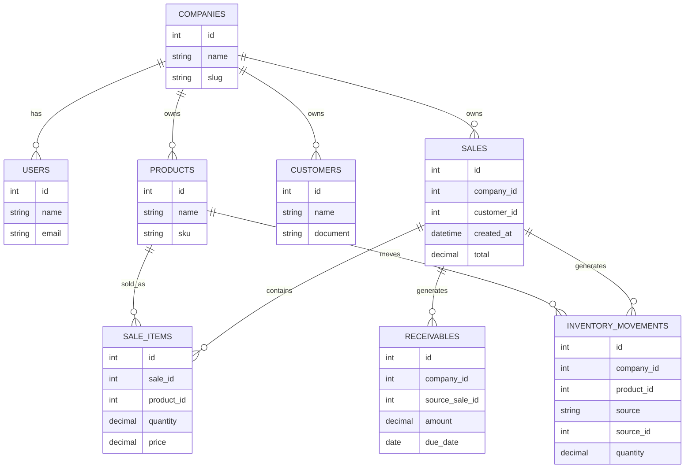

# Elix ERP Next — Core Data Model (ERD)

Este documento define o **modelo de dados central do ERP**.

Ele representa as entidades principais que sustentam o sistema e suas relações.

Objetivo:

- evitar inconsistência estrutural
- servir como referência para novos módulos
- orientar decisões de banco de dados
- alinhar backend e frontend

---

# Visão Geral do Modelo

O coração de um ERP gira em torno de alguns conceitos fundamentais:

- empresa
- usuários
- produtos
- clientes
- vendas
- movimentação de estoque
- títulos financeiros

---

# Diagrama ER (Core)

---

# Fluxo de Dados

O fluxo central do ERP segue o seguinte caminho:

Produto
   ↓
Venda
   ↓
Itens da Venda
   ↓
Movimentação de Estoque
   ↓
Títulos Financeiros

Ou seja:

- uma venda gera movimentação de estoque
- uma venda gera contas a receber

---

# Entidades Principais

## Companies

Representa cada empresa dentro do ambiente SaaS.

Todas as tabelas operacionais devem possuir:

company_id

para garantir isolamento de dados.

---

## Products

Cadastro mestre de produtos.

Utilizado por:

- vendas
- estoque
- fiscal

---

## Customers

Cadastro de clientes.

Utilizado por:

- vendas
- financeiro
- fiscal

---

## Sales

Representa uma venda realizada.

Uma venda:

- possui itens
- movimenta estoque
- gera títulos financeiros

---

## Sale Items

Itens pertencentes a uma venda.

Relacionamento:

sale_id
product_id

---

## Inventory Movements

Representa qualquer alteração de estoque.

Origem pode ser:

sale
purchase
adjustment
transfer

---

## Receivables

Representa títulos financeiros a receber.

Normalmente originados de:

sales

---

# Princípios do Modelo

O modelo segue algumas regras fundamentais.

1. Toda entidade operacional possui company_id.
2. Vendas são a origem dos efeitos colaterais do ERP.
3. Estoque nunca é alterado diretamente, apenas via movimentações.
4. Financeiro nasce a partir de eventos comerciais.

---

# Evolução Futura

O modelo poderá evoluir com:

- purchases
- payables
- stock_locations
- fiscal_documents
- production
- services

---

# Referências

Outros documentos relacionados:

- ARCHITECTURE.md
- docs/00-overview/erp-map.md
- docs/00-overview/architecture-diagram.md
- docs/adr/*
